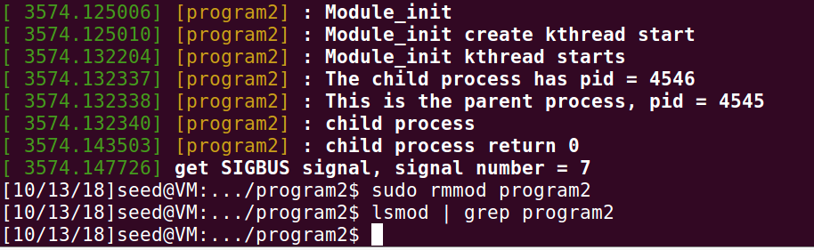

#  Simplified Report

**DEDICATE IMPLEMENTATION OF BONUS IS WELCOM.**

**THIS IS THE MOST CHALLENGING ONE IN ALL OF 5 ASSIGNMENTS.**

### Task 1

#### Object

- Fork a child process to execute the test program. (10 points)
- When child process finish execution, the parent process will receive the `SIGCHLD` signal by `wait()` function. (5 points)
- There are 15 test programs provided. One is for normal termination, and the rest are exception cases. Please use these test programs as your executing program.
- The termination information of child process should be print out. If normal termination, print normal termination and exit status. If not, print out how did the child process terminates and what signal was raised in child process. (15 points)


#### Implementation

In the `main` function, invoking `fork()` can fork a child process. `fork()` will return -1 if the creation of a child process was unsuccessful, or returns a 0 to the newly created child process and a positive value (the PID of the child process) to the parent process. Hence,  `pid` is used as a condition checker to identify the process. 

If `pid < 0`, i.e. the creation of a child process fails, it will produce a message on the standard error output with `"Fork error"` and exit.

If `pid == 0`, i.e. the child process, it will first get the command line variable except the first one, and then invoke `execve()` to execute the given program. By assumption, the codes in child process under the `execve()` will not be implemented. So there is a `perror("execve")` at the end of child process to mark the error if the given program is not executed.

If `pid > 0`, i.e. the parent process, it will wait until it receive the terminated signal from its child process, print out the corresponding signal message and exit. In this part, I first use `wait(&status)` to wait the child process and use an array to simplify my output implementation. However, `wait(&status)` cannot catch `SIGSTOP` signals so I use `waitpid(pid, &status, WUNTRACED)` instead later. As for the char array, I still need to check and format different signal, so I use a switch case instead.


#### Steps to Execute

Under the `program1` directory, open the `Terminal`, type the following commands to compile:

```bash
$ make clean
$ make
```

After compiling, type the following commands to execute a specific program:

```bash
$ ./program1 $TEST_CASE_NAME$
```

where \$TEST_CASE_NAME$ is the name of test case program. 

For example, one can type

```bash
$ ./program1 ./stop
```

to test case stop signal.


#### Result

1. Test `abort`:

<p align="center"></p>

<p align="center">Figure 1: the ouput of abort</p>

​		Work as expected.

2. Test alarm:

   <p align="center"></p>

   <p align="center">Figure 2: the output of alarm</p>

   ​	Work as expected.

3. Test bus:

<p align="center"></p>

<p align="center">Figure 3: the output of bus signal</p>

​		Work as expected.

4. Test float:

<p align="center"></p>

<p align="center">Figure 4: the output of float signal</p>

​		Work as expected.

5. Test hangup:

<p align="center"></p>

<p align="center">Figure 5: the output of hangup</p>

​		Work as expected.

6. Test illegal instruction:

<p align="center"></p>

<p align="center">Figure 6: the output of illegal instruction</p>

​		Work as expected.

7. Test interrupt:

<p align="center"></p>

<p align="center">Figure 7: the output of interrupt signal</p>

​		Work as expected.

8. Test kill:

<p align="center"></p>

<p align="center">Figure 8: the output of kill signal</p>

​		Work as expected.

9. Test normal:

<p align="center"></p>

<p align="center">Figure 9: the output of normal termination</p>

​		Work as expected.

10. Test pipe:

<p align="center"></p>

<p align="center">Figure 10: the output of pipe signal</p>

​		Work as expected.

11. Test quit:

<p align="center"></p>

<p align="center">Figure 11: the output of quit signal</p>

​		Work as expected.

12. Test segment fault:

<p align="center"></p>

<p align="center">Figure 12: the output of segment fault signal</p>

​		Work as expected.

13. Test stop:

<p align="center"></p>

<p align="center">Figure 13: the output of stop</p>

​		My original program cannot catch STOP signal. 

14. Test terminate:

    <p align="center"></p>

    <p align="center">Figure 14: the output of terminate signal</p>

    Work as expected.

15. Test trap:

    <p align="center"></p>

    <p align="center">Figure 15: the output of trap signal</p>

    Work as expected.


#### Analysis

The reason for unexpected output of `SIGSTOP` is that `SIGSTOP` cannot be caught or ignored by `wait()`. However, the more general wait function, known as `waitpid()`, can accept `WUNTRACED` as its third parameter to wait and catch the signal from given `pid` process. The output of revised code is shown below:

<p align="center"></p>

<p align="center">Figure 16: the output of revised program handling stop signal</p>


------

### Task 2

#### Object

Within the template (program2.c), please implement the functions below: 

- When `program2.ko` being initialized, create a kernel thread and run `my_fork` function. (10 points) 
- Within `my_fork`, fork a process to execute the test program. (10 points) 
- The parent process will wait until child process terminates. (10 points) 
- Print out the process id for both parent and child process. (5 points) 
- Within this test program, it will raise signal. The signal could be caught and related message should be printed out in kernel log. (10 points) 
- Follow the hints below to implement your function. If the function is non-static, you should firstly export this symbol so that it could be used in your own kernel module. After that, you should compile the kernel source code and install it. (Kernel compile: 15 points)


#### Implementation

Firstly, download a specific version kernel ( 4.10.14) and modify it.

The modified position is listed below:

<p align="center"></p>

<p align="center">Figure 17: Export _do_fork() in /kernel/fork.c</p>

<p align="center"></p>

<p align="center">Figure 18: Export do_wait() in /fs/exit.c</p>

<p align="center"></p>

<p align="center">Figure 19: Export do_execve() in /fs/exec.c</p>

<p align="center"></p>

<p align="center">Figure 20: Export getname() in /fs/namei.c</p>

Under `/usr/src/linux-4.10.14/`, type the following command to compile and switch to the new kernel:

```bash
$ sudo make mrproper  // remove most generated files + config + various backup files
$ sudo make menuconfig  // choose exit and save the default config

$ sudo make -j3  // compile kernel with 3 threads, be care of the memory leak if happens (I encounter 2 times)

$ sudo make modules_install  // install modules
$ sudo make install  // install the kernel

$ reboot  // after shutting down and before entering BIOS, tap on shift key to mount the new kernel
```

After rebooting, go to `program2` directory and design the Loadable Kernel Module (LKM).  The above exported functions should be set as `extern` in `program2.c`. 

When this LKM is loaded, it will run from `module_init(program2_init)` to `module_exit(program2_exit)`. It invokes `kthread_create(&my_fork, NULL, "Program2ForkThread")` to create a new thread to run `my_fork()` with name `Program2ForThread`. If the creation success, it will wake up the new thread by calling `wake_up_process()`. 

In `my_fork()`, it first initializes the variables needed. For example, the `struct wait_opts` is used for setting the preference of waiting a process. Since this structure is defined in `/fs/exit.c` rather than a head file, I just directly copy its definition from the source code to the top of `program2.c`. Under the instruction of TA, I import several lines of code to set default sigaction for current process in `my_fork()`. Then `_do_fork()` is invoked to fork a process, which executes `DoMyExecve()`. The `my_fork()` is the parent process and it will wait the termination signal from its child process by calling `do_wait()`. For the simplicity of formatted kernel message, I define a char * array on the top of `program2.c` named `IPC_SIG`.

In `DoMyExecve()`, which is the function of child process, it calls `do_execve()` to execute the program of `test`, which is the executable file of `test.c`. I try to set the relative path for `test` but fails so I set an absolute path here.

<p align="center"></p>

<p align="center">Figure 21: the output of kernel message if set relative path</p> 

Besides the above problem, there is another warning while compiling:

<p align="center"></p>

<p align="center">Figure 22: warning message in compiling</p>

This is because ISO C90 requires kernel program declares all the variables needed before other logical codes. The compiler first initializes space for these declarations and then execute the codes following. So I move all the declarations in the top of each function.


#### Steps to Execute

Under the `program2` directory, open the `Terminal`, type the following command to compile `test.c` program:

```bash
$ gcc -o test test.c
```

Before compile `program2.c`, change the value of `filename` in line 60 to your own `test` location. In my case, the location is `/media/sf_CSC_3150_r/Ass/CSC3150_Assignment_1/source/program2/test`, so I set:

```c
const char __user *filename = "/media/sf_CSC_3150_r/Ass/CSC3150_Assignment_1/source/program2/test";
```

Save the file and exit.

Type the following commands to compile and insert the kernel module(i.e. `program2.ko`):

```bash
$ make  // compile loadable kernel moduel program2
$ sudo insmod program2.ko  // insert module program2
```

After a while, remove the kernel module:

```bash
$ sudo rmmod program2.ko
```

Display the kernel message by:

```bash
$ dmesg
```


#### Result

The original kernel version is:

<p align="center"></p>

<p align="center">Figure 23: the original kernel version</p>

After modifying, compiling and switching kernel, the loaded kernel version is:

<p align="center"></p>

<p align="center">Figure 24: the new kernel version</p>

Following screenshoots are the output of insert and remove the required LKM:

<p align="center"></p>

<p align="center">Figure 25: the screenshoot of make, insert and list the LKM</p>

Type `dmesg` to show the kernel message:

<p align="center"></p>

<p align="center">Figure 26: the screenshoot of kernel message, rmove and list LKM</p>

#### Analysis

Memory is divided into User Space and Kernel Space. The LKM is mainly loaded and running on kernel space. User space cannot access kernel space directly, but kernel space can access user space by using some APIs. A `__user` flag is set to announce the variable to initialize in user space. The `set default sigaction for current process` part in `my_fork()` is used for catch the signal from user space for the current process. `wait_opts` helps to set the preference of waiting a process. The most important one is tracing the process status of a given process. Invoking `find_get_pid()` can get the pid of child process, then this value can be set to `wo.wo_pid`. `wo.wo_stat` is set to `&state` so whenever the status of process changes, `wo.wo_stat` will change the value in `state`. As shown in *Figure 26*, the parent process catches the signal from child process correctly. The mechanism of dividing memory space is for security principle, and it introduces the most difficult part in this task.

The creation of kernel thread and process is relatively simple. Processes are running in threads, so LKM should first create the kernel thread and then fork a process. When the LKM is inserted into kernel, typing `lsmod | grep $MODULE_NAME$` (in this case, \$MODULE_NAME$ is `program2`) in terminal can display whether a given module is loaded. As shown in *Figure 25* and *Figure 26*, module `program2` is displayed after inserting and disappeared after removing, which works as expected.

The only weird thing is, by assumption, the code under `do_execve()` in `DoMyExecve()` will be overwritten by `test`. However, as shown in `Figure 26`, it executes the code under `do_execve()` (i.e. `print [program2] : child process return 0`)! This is my limitation of this task since I haven't had any idea to explain it yet.