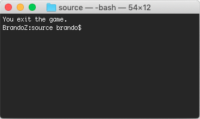

#  Simplified Report

**I DID NOT MAKE THE LOGS MOVING IN RANDOM SPEED.**

### Object

#### 1. Game Rule

A river has logs floating on it, and a frog must cross the river by jumping on the logs as they pass by. The symbol of game's objects are listed below:

<p align="center"></p>

<p align="center">Figure 1: Demo User Interface</p>

As shown in *Figure 1*, `|||||||||||||||||||||` denotes a river bank, `==========` denotes a log, and `0` denotes a frog. The user can control the frog jumps or quit the game by tapping following keys:

- W: Up
- S: Down
- A: Left
- D: Right
- Q: Quit the game

User will win if the frog jumps to the other bank of river successfully, otherwise, he/she will lose if the frog lands in the river, or the log reaches the left/right side of the river but the frog still on it. 


#### 2. Function Requirement

- To run the template, you will see the frog stands in the middle at bottom bank of river. There are 9 blank rows which means the river. Compile the program to see the static output. (5 points) 

- You should complete the function named “logs_move” to let the logs can move staggery from left to right or from right to left. (20 points) 
- You should create pthread and use mutex lock for logs and frog movement control. (30 points) 
- “kbhit” function is provided for keyboard capture. You should complete the jump rules for keyboard actions. And the frog’s position should be updated when keyboard hits. (15 points) 
- When the logs are moving, the program should be able to judge the game status (win, lost or quit). Print out the message for user whether he/she wins or lost the game. (15 points) 
- If the user quits the game, print the message. (5 points) 

### Implementation

#### 1. Design of the program

<p align="center"></p>

<p align="center">Figure 2: Program Flow</p>

As shown in *Figure 2*, there are mainly 3 functions in this program: `main()`, `logs_move()` and `frog_move()`. Among them, `main()` responses for game initialization, pthread creation, and tracking game status. `log_move()` controls the movement of a log. `frog_move()` responds to the keyboard event, monitors game status, and prints the map into screen.

First, `main`() initializes the river map and frog's starting position. Then, it initializes `map_mutex` and `log_complete`. `map_mutex` is a pthread mutex used for protecting map content from being modified by several threads, while `log_complete` is the mutex condition of allowing `frog_move()` to add the frog on the map. After that, it creates 9 pthreads for logs movement (one thread for one log) and 1 pthread for frog movement. 

Second, 9 `logs_move()` pthreads control the movement in each line in the river. It picks a starting point randomly and invokes `direction_is_left()` to decide the moving direction. `usleep()` is used here to control the refresh rate of the logs (in another word, it controls the speed of a log). Default speed is `REFRESH_TIME * 2` for each log, where `REFRESH_TIME` is the time interval of refreshing the frog. If you want to play a game with each log moving at different speed, you can simply revert the command of `usleep(rand() % 2000)` to do so. But personally, I think it is odd. When a log moves, it locks the `map_mutex` to modify the content in map, and then raises a signal to wake up `frog_move()`, which is waiting for the `log_complete`. With this approach, the program can protect the shared data `map`, and arrange the priority of shared data modification among different threads.

Third, 1 `frog_move()` pthread wakes up when it catches the condition signal. After locking the `map_mutex`, it changes the frog's position according to the keyboard event or the place it stands on, and check if the frog is in the river or goes out of the boundary. If the frog is still alive, this function will print the map into console. If the game is over, this function changes the game status and releases `map_mutex`.

Finally, `main()` synchronizes with above 10 pthreads, displays the output for user and destroy the `map_mutex` and `log_complete` to release the resources.


#### 2. Problems encountered

##### 2.1 Frog is blinking on logs

At the beginning, the frog is blinking when it stands on a log. This is because both `logs_move()` and `frog_move()` can modify the map content, and sometimes they actually compete with each other to add `0` or `=` on the map. So I initialize a pthread mutex to lock the shared data `map` whenever any thread wants to modify it. However, the issue still exited. After a while, I realized that although these pthreads will not access to the shared data concurrently, the uncontrolled modify order still allows `logs_move()` to overwrite `0` with `=` at some print out time. Eventually, I add a pthread condition for `logs_move()` to raise after modifying the `map` and `frog_move()` can add `0` to the `map` if and only if it receive the signal, which solves the problem.  

##### 2.2 Deadlock

When the frog dies (reaches the boundary or jumps into the river), the program runs into a deadlock. At first I thought it was because I did not implement `pthread_join()` in `main()` to synchronize the status of pthreads. But eventually I found that it was due to the `break` makes the program flow jumps to `pthread_exit()` directly and leaves the `map_mutex` unreleased, which causes the deadlock. The following codes show my modification to fix the problem:

```c++
        /*  Check game's status  */
        if (map[frog.x][frog.y] == ' ' || frog.y < 0 || frog.y > COLUMN - 2) {  // frog dies
            game_status = LOSE;
            pthread_mutex_unlock(&map_mutex);  // this line is new adding
            break;
        }
```


### Steps to Execute

#### 1. How to change the speed:

Open `hw2.cpp`, in the top of it, change the following value to control the refresh frequency. The refresh rate of logs is $$\frac{1}{2 \times REFRESH\_TIME}$$ while that of frog is $$\frac{1}{REFRESH\_TIME}$$ and print map at $$\frac{3}{REFRESH\_TIME}$$. That is to say, the greater the `REFRESH_TIME` is, the slower the logs will move. 

```C++
#define REFRESH_TIME 70000
```

#### 2. How to compile:

In the `source` directory, type the following command to compile the program:

```bash
$ g++ hw2.cpp -lpthread
```

#### 3. How to execute

In the `source` directory, type the following command to execute the game:

```bash
$ ./a.out
```


### Result

<p align="center"></p>

<p align="center">Figure 3: Screenshoot of a New Game</p>

The program works as expected.

<p align="center"></p>

<p align="center">Figure 4: Screenshoot of Exit the Game</p>

The program works as expected.

<p align="center"></p>

<p align="center">Figure 5: Screenshoot of Lose the Game</p>

The program works as expected.

<p align="center"></p>

<p align="center">Figure 6: Screenshoot of Win the Game</p>

The program works as expected.