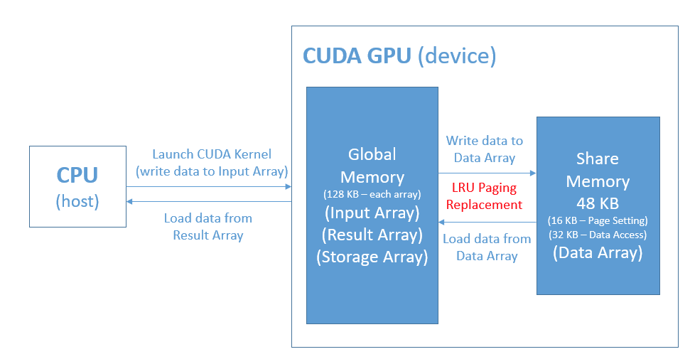
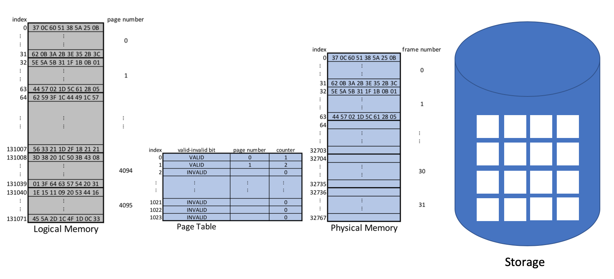
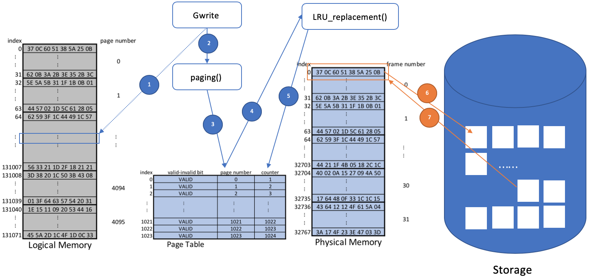
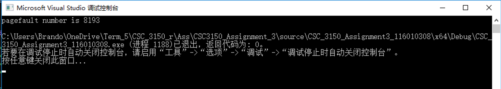
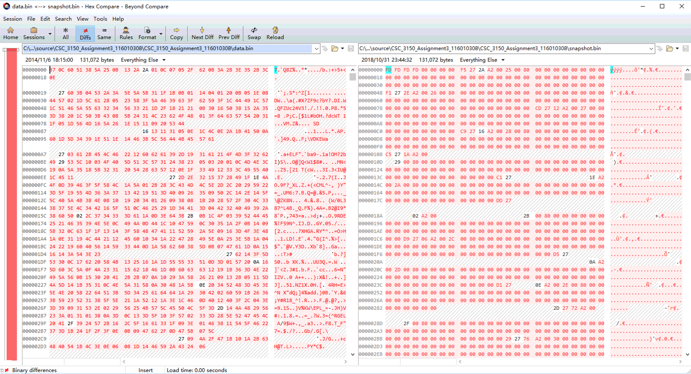
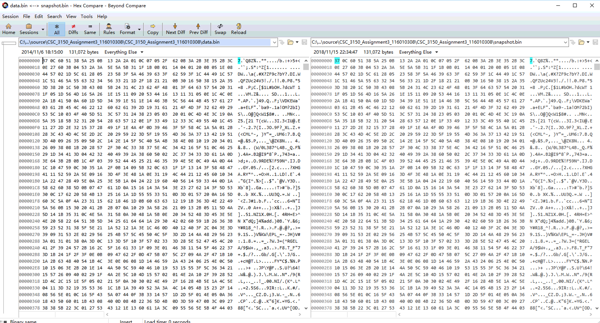
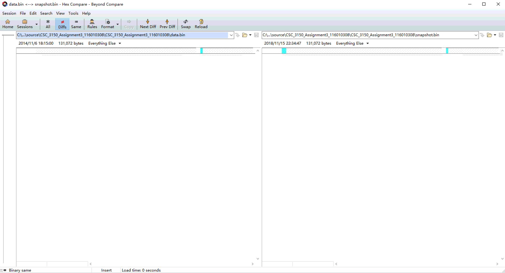

#  Simplified Report

**I ONLY PROVIDE RESULT ON WINDOWS SYSTEM.**

### Object

In Assignment 3, you are required to simulate Least Recently Used Paging of virtual memory  management via GPU's memory with CUDA. There are many kinds of memory in CUDA GPU, here we treat `Global Memory` as the `secondary memory` (128KB) while `Shared Memory` as the `physical memory` (48KB). In `physical memory`, 32KB is used for `data` access and 16KB is used for `page table` setting. The specification can be shown as *Figure 1*:

Figure 1: Diagram of Specification

Note that the length of input data is 128KB so it cannot be handled by `physical memory` directly. With the approach of `LRU paging` with sufficient storage as the secondary memory, you should finish the procedure of `Gwrite`, `Gread` and `snapshot`.

In short, you need to fulfill the following requirements:

- `Gwrite`: write data into buffer (physical memory)
- `Gread`: read data from buffer
- `snapshot`: together with Gread, you should complete the program to load the elements of data array (in shared memory, as physical memory) to results buffer (in global memory, as secondary storage), using LRU algorithm
- Count pagefault number
- Dump the contents of binary file into `snapshot.bin`

### Implementation

#### 1. Design of the program

Figure 2: Diagram of Virtual Memory Management

*Figure 2* shows the diagram of virtual memory management in the first 2 page. Basically, `Gwrite`, `Gread` and `snapshot` work on the logical memory, they can refer to a content element within the size of logical memory. That is to say, in this case, they can "access" to the data from `index 0` to `index 131071` since the size of logical memory is set as 128KB. The content elements are divided to several blocks with size of 32 bytes called "page". So the number of total legal pages equals to $\frac{128\ KB}{32\ byte}=4096$, and the legal page number is from 0 to 4095. However, the physical memory is only 32KB, so when `Gwrite`, `Gread` or `snapshot` tries to handle a data larger than physical memory, we need a mechanism  to migrate the data between physical memory and storage, and translate the referenced address (virtual address) to physical address. The function helped to translate the virtual address to physical address is called `paging()`, while the function aimed to ship data between physical memory and storage is called `LRU_replacement()` in my program. 

To implement LRU algorithm, a global variable named `LRU_clock` is set to increase its value whenever someone accesses the corresponding frame in physical memory. Besides, the page table `pt[]` is modified into 3 fields: `pt[i]` from `0 to PAGE_ENTRIES-1` stores valid-invalid bit, `pt[i]` from `PAGE_ENTRIES to 2*PAGE_ENTRIES-1` stores page number, and `pt[i]` from `2*PAGE_ENTRIES to 3*PAGE_ENTRIES-1` stores counter. The index (from 0 to 1023) represents corresponding frame number in the physical memory. The size of revised page table is $1024\times3\times4\ byte = 12288\ byte < 16384\ byte$, so it agrees with the requirements. When a frame is accessed by other functions, its `counter` field will be updated to the value of `LRU_clock`, which implies that the smaller a `counter` value is, the earlier this frame is used.  

Hence, the function flow of `LRU_replacement()` can be shown as *Figure 3*:

Figure 3: Function Flow of LRU_replacement()

Then, the `paging()` can also be implemented easily as *Figure 4*:

Figure 4: Function Flow of paging()

As shown in *Figure 4*, the `paging()` first check if the referenced page is legal, i.e., the page number is within the size of logical memory, and exit if it is illegal. Then, `paging()` will go through the page table to see if the referenced page is on the physical memory, if there is, it returns the address in terms of physical memory, otherwise it will further check if there is free frame. In page table, if a frame's `valid-invalid bit` is set to `INVALID`, this frame is free. The program defines `VALID` as `0x76` since it is the ASCII code of `v`(alid), while the value of `INVALID` inherits from the template. If there is free frame, `paging()` will migrate the referenced page from storage to this frame, otherwise it invokes `LRU_replacement` to swap the least recently used page out and swap the required page in. After invoking `LRU_replacement`, `paging()` can call itself safely because it is bound to fall into the case of `referenced page is on the physical memory`.

Then, take the procedure of writing on page 32 as an example to show the whole process of virtual memory management:

Figure 5: Procedure of Writing on Page 32

1. `Gwrite()` intends to access page 32 (on logical memory). It cannot do that directly, so this arrow line is presented in dots;
2. Instead, `Gwrite()` calls `paging()` as the agent to access the required page;
3. `paging()` checks whether the referenced page is on the physical memory by going through the page table;
4. At this time, page 32 is not on the physical memory, so `paging()` invokes `LRU_replacement()` to do the page replacement;
5. `LRU_replacement()` goes through the page table and selects frame 0 as the victim frame since its counter is the minimum in page table;
6. Frame 0 stores page 0, which is the victim page. Victim page is swapped out to its corresponding position in storage;
7. The referenced page (page 32) is then swapped in to the victim frame from storage;
8. `paging()` then returns the address of page 32 in physical memory (starts from index 0).

#### 2. Problems encountered

##### 2.1 Computer will get stuck whenever the program runs

During the running time, the display will get stuck. This is because the GPU memory is occupied by the program and there is limited resources for rendering display via GPU. This problem can be figured out if we switch to integrated GPU for display rendering. 

##### 2.2 Sometimes the program crashes or the pagefault number is incorrect 

Sometimes the program will exit unexpectedly with overwriting `snapshot.bin` with all 0 or output an incorrect pagefault number. This is mainly caused by the  setting of Timeout Detection & Recovery (TDR) is not sufficient for executing the program. If the execution time is over the setting in TDR, CUDA will kill the whole process safely. In practice, the running time of my program varies from 110 seconds to 160 seconds. Besides, the unnecessary functions like `printf` or screen synchronization service like TeamViewer will compete the resources of GPU, which leads to longer execution time and incorrect pagefualt number.

The execution time can be improved by applying hash table search or two level paging instead of linear search on the page table. However, due to the limited time, these approaches haven't been implemented yet.

### Steps to Execute

 Recommend to set the TDR as 180.

#### 1. How to compile:

In Visual Studio 2017, open project `CSC_3150_Assignment3` and tap `ctrl + shift + B` to compile this program.

#### 3. How to execute

In Visual Studio 2017, tap `ctrl + F5` to execute the program.

### Result

Figure 6: Check Pagefault Number

Work as expected.

Figure 7: Original Content in data.bin and snapshot.bin

Figure 8: The Difference between Original data.bin and Original snapshot.bin

Figure 9: Content after Snapshot

Figure 10: The Difference between Original data.bin and Modified snapshot.bin 

*Figure 7 to Figure 10* show that this program did copy the content from `data.bin` to `snapshot.bin`.