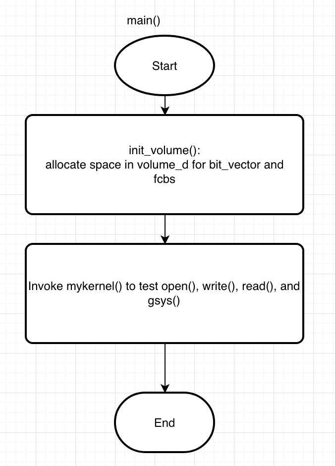

#  Simplified Report

**I REMEMBER THAT THERE IS A BUG ON PAGE FAULT COUNTING.**

### Object

In Assignment 4, we need to design a GPU File System :

- We take the global memory as a volume (logical drive) from a hard disk.
- No directory structure stored in volume, only one root directory, no subdirectory in this file system.
- A set of file operations should be implemented.
- In this project, we use only one of GPU memory, the global memory as a volume. We don’t create the shared memory as physical memory for any data structures stored in, like system-wide open file table in memory.
- In this simple file system, we just directly take the information from a volume (in global memory) by single thread.

<p align="center"></p>

<p align="center">Figure 1: Diagram of Specification</p>


Function Requirements (90 points):

- Implement file volume structure. (10 points)
- Implement free space management. (For example, Bit-Vector / Bit-Map). (10 points)
- Implement contiguous allocation. (10 points)
- Implement open operation (10 points)
- Implement write operation (10 points)
- Implement read operation (10 points)
- Implement rm operation (10 points)
- Implement LS_D operation (10 points)
- Implement LS_S operation (10 points)


### Implementation

#### 1. Design of the program

<p align="center"></p>

<p align="center">Figure 2: Diagram of Program Flow</p>

*Figure 2* shows the diagram of my program flow. Here I modified the `main()` to initialize `volume_d`. 

I design a data structure to simplify the operation on `FCB` (*see Implementation 2.1*), and then make use of `casting` to allocate enough space in `volume_d` to store it. Similar for that of `bit_vector`, which is the super block to trace the available block in `volume_d`. 

In `init_volume()`, it casts the above data structures, resets `bit_vector` and `fcbs`.


<p align="center"></p>

<p align="center">Figure 3: Function Flow of open()</p>

As shown in *Figure 3*, the `open()` mainly deals with mode grant. For example, the `G_WRITE` grants `write` mode to the referring file while `G_READ` grants `read` mode to that file. Besides, it set the `used` bit in `FCB` if the open mode is `G_WRITE` and updates the `created_time` and `modified_time`.

Then, the `write()` can be implemented as *Figure 4*:

<p align="center"></p>

<p align="center">Figure 4: Function Flow of write()</p>

As shown in *Figure 4*, the `write()` first check if the program tries to access an non-existing FCB and aborts the process if it is true. `write()` will go through the `bit_vector` to see if there is enough space to write, if there is not, abort the operation and reset the `used` bit.

For `read()`, it is much easier, we just need to check if he program tries to access an non-existing FCB and aborts the process if it is true.

<p align="center"></p>

<p align="center">Figure 5: Function Flow of read()</p>


<p align="center"></p>

<p align="center">Figure 6: Function Flow of gsys(op)</p>

<p align="center"></p>

<p align="center">Figure 7: Function Flow of gsys(op, s)</p>

The program of gsys() can be described as *Figure 6* and *Figure 7*.


#### 2. Problems encountered

##### 2.1 Allocate Super Block (bit vector), FCB, and file content block in volume

My first approach to simulate the file system with `Super Block`, `File Control Block`, and `file content block` allocated in volume was to define several `offset` to access different part of volume like the way in `Assignment 3`. However, it is tedious and brings me a lot of trouble. After doing some research, I found a smart way to solve this problem.

I declared two global variable `bit_vector` and `fcbs` like:

```C
typedef struct FileControlBlock
{  /* size of an FCB = 20 + 1 + 1 + 2 + 4 + 2 + 2 = 32 bytes */
	char file_name[MAX_FILENAME_SIZE];  // file name, 20 bytes
	u8 used;  // 1 byte
	u8 mode;  // G_WRITE or G_READ, 1 byte
	u16 block_idx;  // 2 bytes
	u32 file_size;  // size of a file, 4 bytes
	u16 created_time;  // create time of a file, 2 bytes
	u16 modified_time;  // modified time of a file, 2 bytes
} FCB;

__device__ __managed__ u32 *bit_vector;  // num of total blocks is 32768, so we need 32768 bits as the bit vector
__device__ __managed__ FCB *fcbs;  // file control blocks
```

Then, when the program starts to initialize the volume, it casts some parts of the volume to the corresponding part:

```C
	bit_vector = (u32*)volume_d;  // allocate the head space in volume_d for bit_vector (4KB)
	fcbs = (FCB*)(volume_d + SUPERBLOCK_SIZE);  // allocate the following space in volume_d for the table of FCBs (32KB)
```

Since it is global variable, later I can access to `fcbs` or `bit_vector` like:

```C
	for (i = 0; i < NUM_BIT_VECTOR_ELEMENT; i++)
	{  /* initialize bit_vector */
		bit_vector[i] = 0;
	}

...
    
	for (i = 0; i < FCB_ENTRIES; i++)
	{  /* initialize the table of FCBs */
		for (j = 0; j < MAX_FILENAME_SIZE; j++)
		{
			fcbs[i].file_name[j] = '\0';
		}
		fcbs[i].used = 0;
		fcbs[i].block_idx = INVALID;
		fcbs[i].mode = G_READ;
		fcbs[i].file_size = 0;
		fcbs[i].created_time = sys_clock;
		fcbs[i].modified_time = sys_clock;
	}
```

I think it is the most elegant design in my program and it did simplify my debugging procedure  a lot. 


##### 2.2 Limited available memory

`Assignment 4` requires to use at most `4KB` for `Super Block` and at most `32 bytes` for the size of one `FCB`. However, there are `32768 blocks` , so we need `32768 bits` as the bit vector and have to use bit operation. The `bit_vector` is an `u32` array with size of `1024`, which occupies `4KB` and maps all the blocks exactly. As for `FCB`, I have to allocate 20 bytes to store the `file_name` and at least 4 bytes to store the `file_size` (otherwise the file size will overflow). I checked every boundary and finally designed a compact structure `FileControlBlock`.


##### 2.3 Avoid `sys_clock` overflow

In my program, I used a global variable `sys_clock` to trace the system time. However, due to the space I allocate for `FCB.created_time` and `FCB.modifed_time` is only 2 bytes, the clock will reset to `0` after $2^{16}-1$ times `open(file_name, G_WRITE)` operation.  Then I designed a function called `avoid_modified_time_overflow()`, and traces the clock every time after `write()` operation. If the `sys_clock` is going to reset, `write()` invokes `avoid_modified_time_overflow()` to reverse the order of files according to their current `modifed_time`, then it updates the `sys_clock` safely.


### Steps to Execute

 Recommend to set the TDR as 180.

#### 1. How to compile:

In Visual Studio 2017, open project `CSC_3150_Assignment4` and tap `ctrl + shift + B` to compile this program.


#### 3. How to execute

In Visual Studio 2017, tap `ctrl + F5` to execute the program.


### Result

<p align="center"></p>

<p align="center">Figure 8: Check Correcteness of Test Case 1</p>

Work as expected.

<p align="center"></p>

<p align="center">Figure 9: Check Correcteness of Test Case 2</p>

Work as expected.

<p align="center"></p>

<p align="center">Figure 10: Check Correcteness of Test Case 3</p>

Work as expected.