#  Simplified Report

**REMEMBER TO READ THE SPECIFICATION CAREFULLY.**

**NOTE THAT THIS SOLUTION FAILS IN SOME TEST CASE, ANY REVISE IS WELCOME.**

### Object

In Assignment 5, we are required to make a prime device in Linux, and implement file operations in kernel module to control this device. 

#### Outline: 

- We will make a device under `/dev` by `mknod` command. 
- This device can find n-th prime number. 
- Implement file operations in a kernel module to control this device. 
- And implement `ioctl` function to change the device configuration. 
- Simulate registers on device by allocating a memory region. 

#### Global View: 

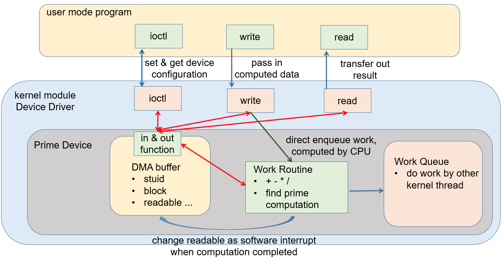

<center>Figure 1: Diagram of Specification</center>


#### Function Requirements (90 points):

- Register a character device when module initialized. (5 points) 
- Initialized a `cdev` and add it to make it alive. (5 points)
- Allocate `DMA` buffer. (5 points) 
- Allocate `work routine`. (5 points) 
- Implement `read` operation for your device. (10 points) 
- Implement `write` operation for your device. (20 points) 
- Implement `ioctl` setting for your device. (15 points) 
- Implement `arithmetic routine` for your device. (10 points) 
- Complete `module exit` functions. (5 points) 
- Update your `student ID` in `test` case and make it be print in kernel ioctl. (5 points) 
- Run `test` cases to check write and read operations. (5 points) 

### Implementation

#### 1. Design of the program

In this driver, an operation map should be defined in advance in type of `file_operations`:

```C
// cdev file_operations
static struct file_operations fops = {
        owner: THIS_MODULE,
        read: drv_read,
        write: drv_write,
        unlocked_ioctl: drv_ioctl,
        open: drv_open,
        release: drv_release,
};
```

After it is initialized in `init_modules`:

```C
cdev_init(dev_cdevp, &fops);
```

It maps the operations from user space to kernel. For example, when a program in user space invokes `write` for this device, the driver will further call `drv_write` for implementation.

The process of initializing a deriver can be described as shown in *Figure 2*:

<p align="center">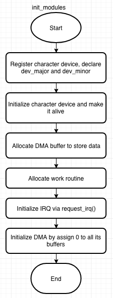</p>

<p align="center">Figure 2: Function Flow of init_modules()</p>

Firstly, it registers the character device named as `mydev`, and then initializes and activates this device. Note that the device should be registered before it is initialized. After that, the program allocates DMA buffer to store data like student ID, interrupt times, or other data come from user space. Fourthly, allocate space for work routine. And then, it initialize `IRQ_handler`, which is required in `bonus`. Lastly, it initializes DMA via assigning 0 or '0' to all DMA buffers. This dose nothing in `./test` (because it invokes `drv_ioctl()` in advance whenever it need to call `drv_write()` or `drv_read()`), but it can avoid user program getting dirty content just after the driver initialization.

If remove the driver, it will go through the following process:

<p align="center">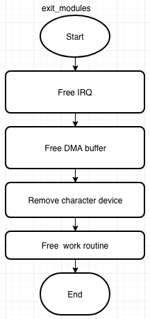</p>

<p align="center">Figure 3: Function Flow of exit_modules()</p>

As shown in *Figure 3*, the `exit_modules()` actually does the opposed things against `init_modules` in reversed order.

Then, the `drv_write()` can be implemented as *Figure 4*:

<p align="center">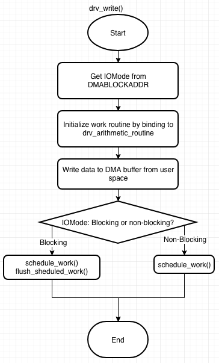</p>

<p align="center">Figure 4: Function Flow of drv_write()</p>

As shown in *Figure 4*, the `drv_write()` first gets `IOMode` from `DMABLOCKADDR` to determine whether it need to blocking. Then, it initializes the work_routine by binding to `drv_arithmetic_routine`, which responses for the arithmetic procedure for the device. To implement arithmetic procedure, `drv_write` also need to copy the `data` (contains `operator`, `operand 1` and `operand 2`) from user space to corresponding buffers in DMA. Finally, it invokes `shedule_work()` (and `flush_sheduled_work()`) according to `IOMode`.

For `drv_read()`, it is much easier, it just need to get the answer from `DMAANSADDR` and then copy this value to user space. Note that the `drv_read()` also cleans the answer in DMA buffer and resets readable bit according to the specification from the assignment.

<p align="center">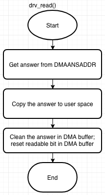</p>

<p align="center">Figure 5: Function Flow of read()</p>

The function flows of `drv_ioctl()` and `drv_arithmetic_routine()` are much easier to be shown in words.

By assumption, user programs should invoke `drv_ioctl` before `drv_read` and `drv_write`. It accepts `cmd` as a parameter to change the device's configuration. So I just implement it with a `switch ... case`, it moves to the case specified by `cmd` and changes corresponding configuration in DMA. For `HW5_IOCWAITREADABLE`, it first checks the readable bit in `DMAREADABLEADDR`, if it is 0, it will invoke `msleep` and check the readable bit again and again until it is set to 1. If readable, it passes 1 to user space, which will assign the signal of readable in user program.

`drv_arithmetic_routine()` is just the kernel version of `arithmetic` in `test.c`. The difference is that the value of data should be gained from DMA rather than parameters. Moreover, after computation, it stores the result in `DMAANSADDR` and sets `DMAREADABLEADDR`.

For bonus, the program implements `IRQ_handler`, which gets interrupt time from `DMACOUNTADDR` and increase this value by 1 and then restore it back to `DMACOUNTADDR`. After handling interrupts, it returns `IRQ_HANDLED`.

#### 2. Problems encountered

##### 2.1 Determine the size to copy to user space

In `drv_read`, it need to copy the answer from `DMAANSADDR` to user space. At first I have want to pass the third parameter, which determine the size to pass to user space, as `sizeof(int)`. However, it will lead to weak flexibility. I finally found out that `size_t ss`, which is the third parameter of `drv_read` will determine the size automatically so I can ease the way to pass data to user space by:

```c
ret = copy_to_user(buffer, &ans, ss);
```


##### 2.2 Last parameter of request_irq()

When I started to do the bonus question, I got confused about the last parameter that should be passed to `request_irq`. In almost all the manual, they just simply describe it as `A cookie passed back to the handler function` ==[1]==. It makes no sense for me to invoke this function. I've searched for the usage of `request_irq` in kernel codes, and found that people seems to passed this parameter arbitrarily. Finally, I found a document described the function detailedly ==[2]==.


### Steps to Execute

On Linux platform, in the directory of `source`:

```bash
.
├── Makefile
├── ioc_hw5.h
├── main.c
├── mkdev.sh
├── rmdev.sh
└── test.c
```

Type the following command to compile and insert the kernel module `mydev`:

```bash
$ make
```

Run the following command to check available device number:

```bash
$ dmesg
```

In my case, the available MAJOR number is 245 while the MINOR is 0, so I can type `sudo ./mkdev.sh 245 0` like *Figure 6*:

<p align="center">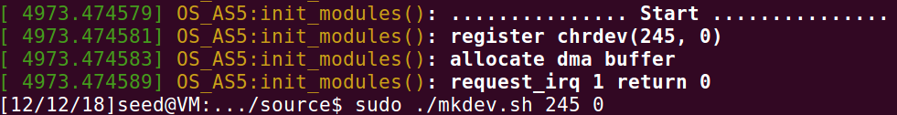</p>

<p align="center">Figure 6: Steps to Build File Node</p>

To test the driver, run:

```bash
$ ./test
```

To remove the module and check the messages, run:

```bash
$ make clean
```

Finally, don't forget to reject the file node, run:

```bash
$ sudo ./rmdev.sh
```


### Result

<p align="center">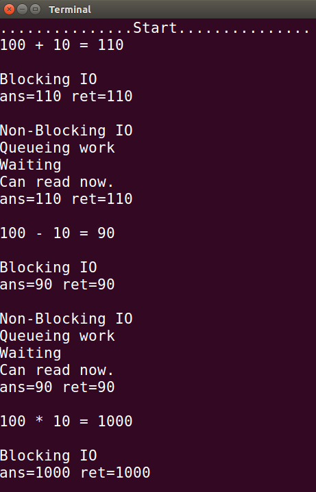</p>

<p align="center">
    Figure 7: Correctness Check for Arithmetic Routine
</p>

<p align="center">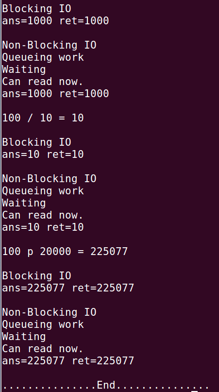</p>

<p align="center">Figure 8: Correctness Check for Arithmetic Routine (Cont.)
</p>

As shown in *Figure 7* and *Figure 8*, this procedure almost tests all the functions required in assignment specification. The program works as expected.


<p align="center">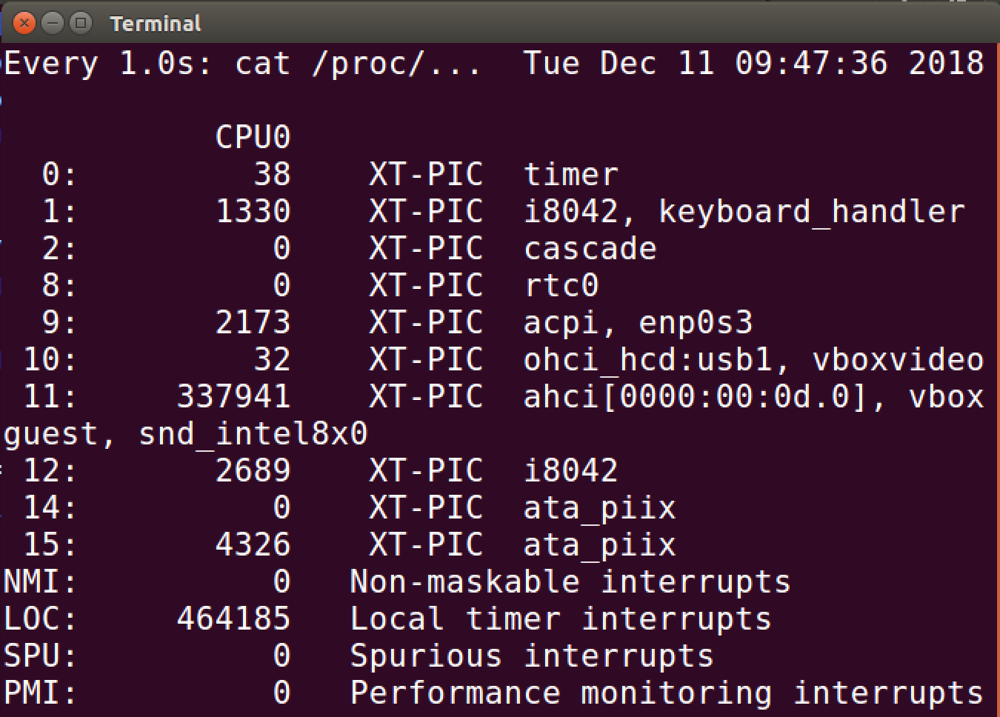</p>

<p align="center">Figure 9: Check Correcteness After Inserting mydev.ko</p>

Works as expected.

<p align="center">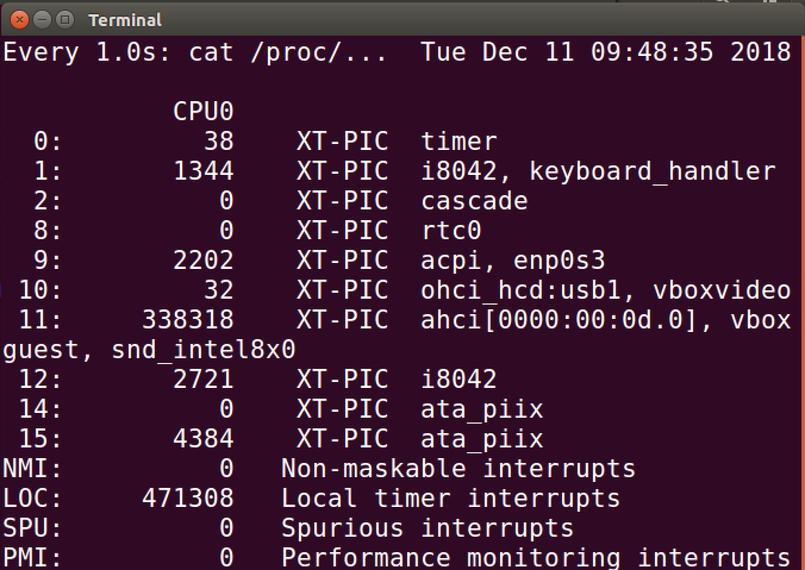</p>

<p align="center">Figure 10: Check Correcteness After Running test</p>

Works as expected.

<p align="center">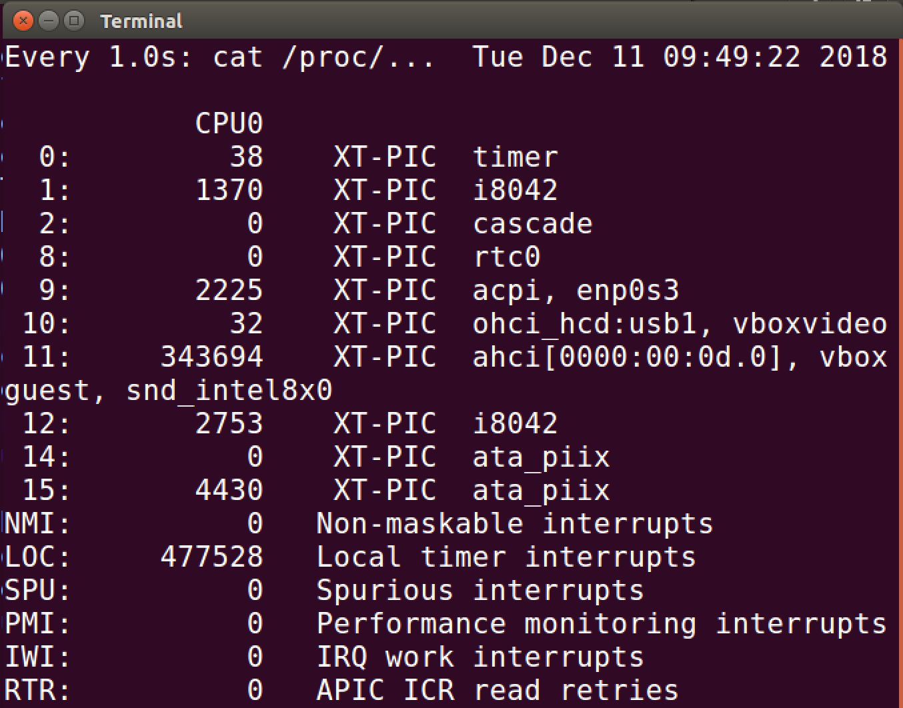</p>

<p align="center">Figure 11: Check Correcteness After Removing mydev.ko</p>

Works as expected.

<p align="center">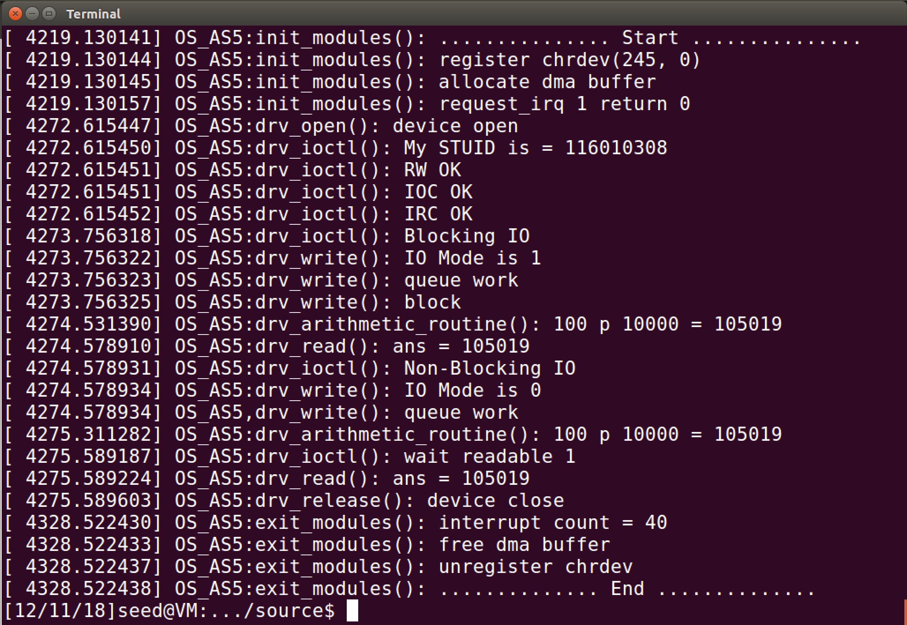</p>

<p align="center">Figure 12: Check Correctness of the Whole Program</p>

Works as expected.

