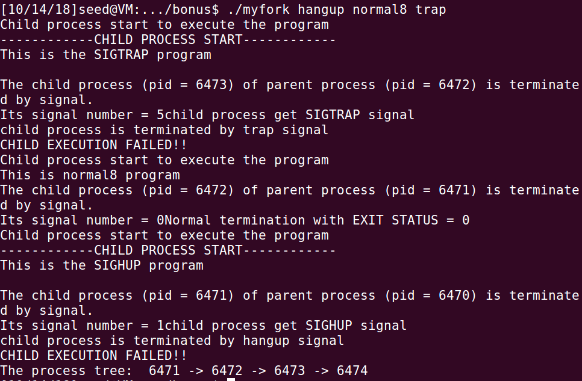
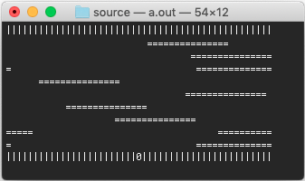
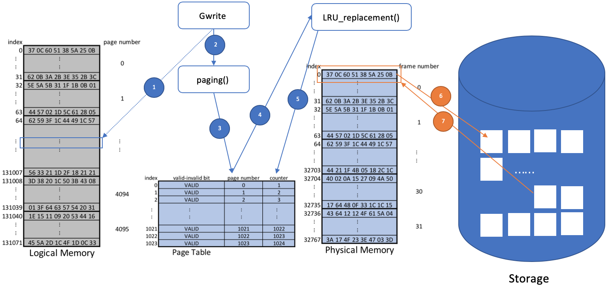
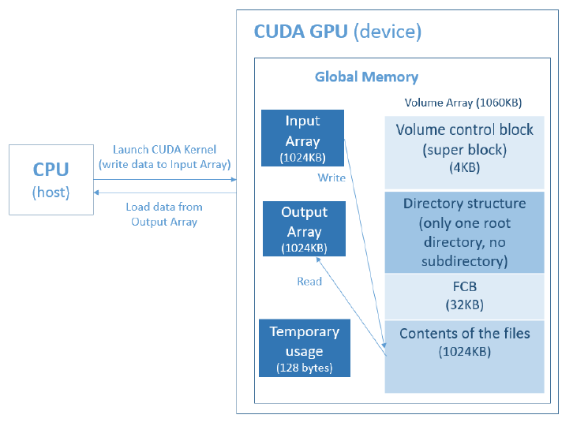
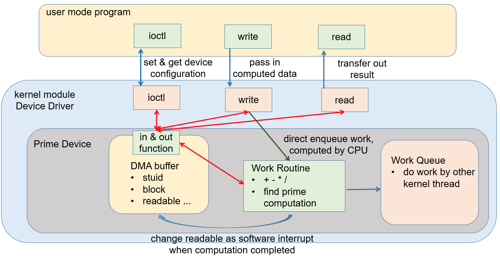

This is an archive of my assignments done in Operating System Course (CSC 3150) in 2018 Fall Term. I publish my work after finishing this course for several reasons:

1. I hope my implementation can inspire someone to come up with a better solution, **but not encourage anyone to directly copy it**. So any *issue* to discuss the implementation is welcome;
2. It is a record of what I've achieved in that semester. I may review some part of the programs in the future.

## Overview

1. Kernel-Mode Programming

   

2. Multi-Thread Programming

3. Virtual Memory Management

   

4. File-System

   

5. I/O System

   

